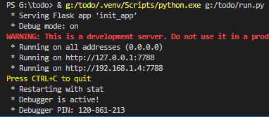
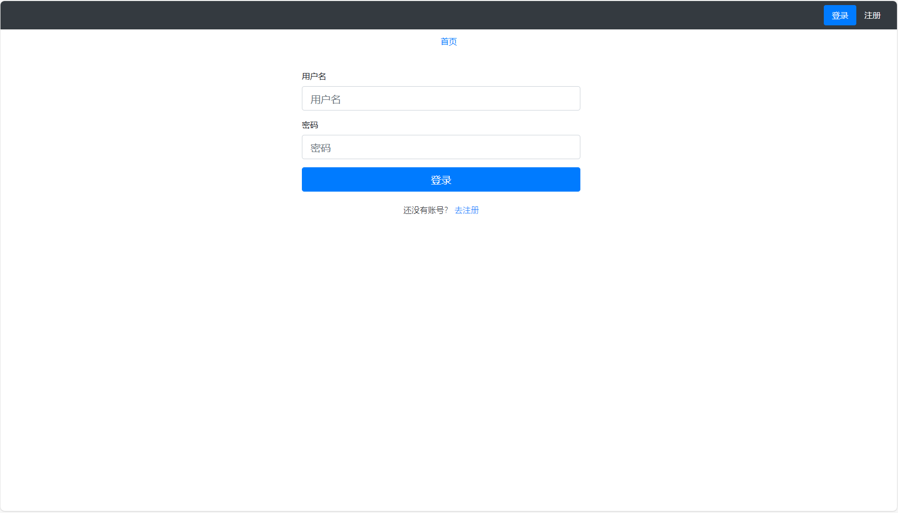
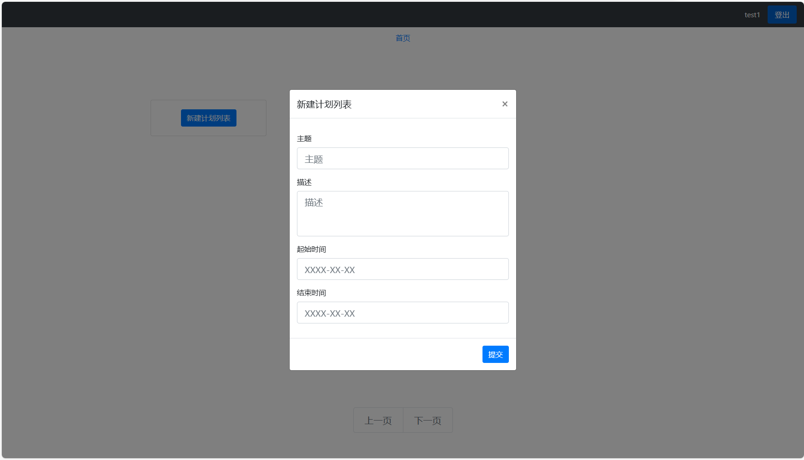
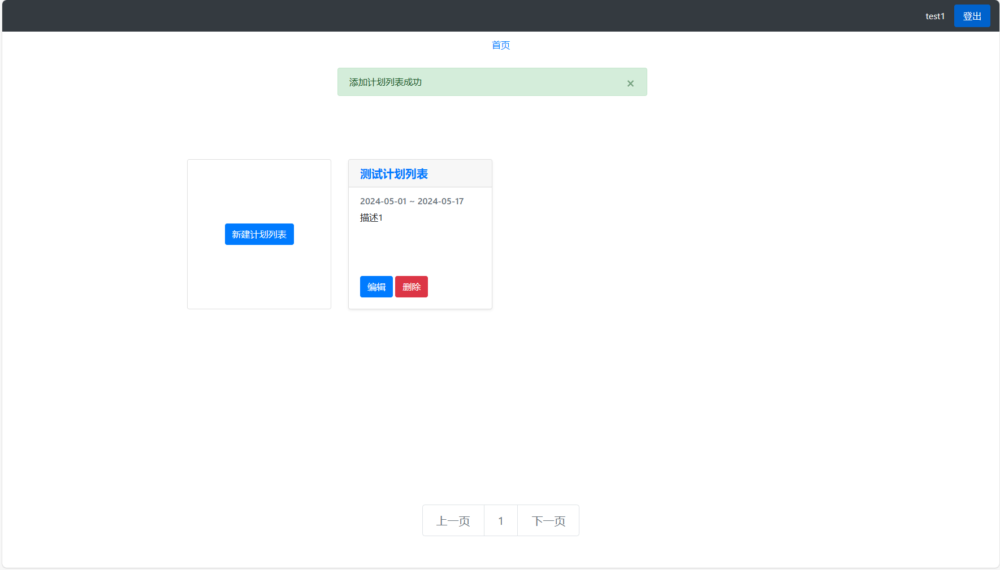
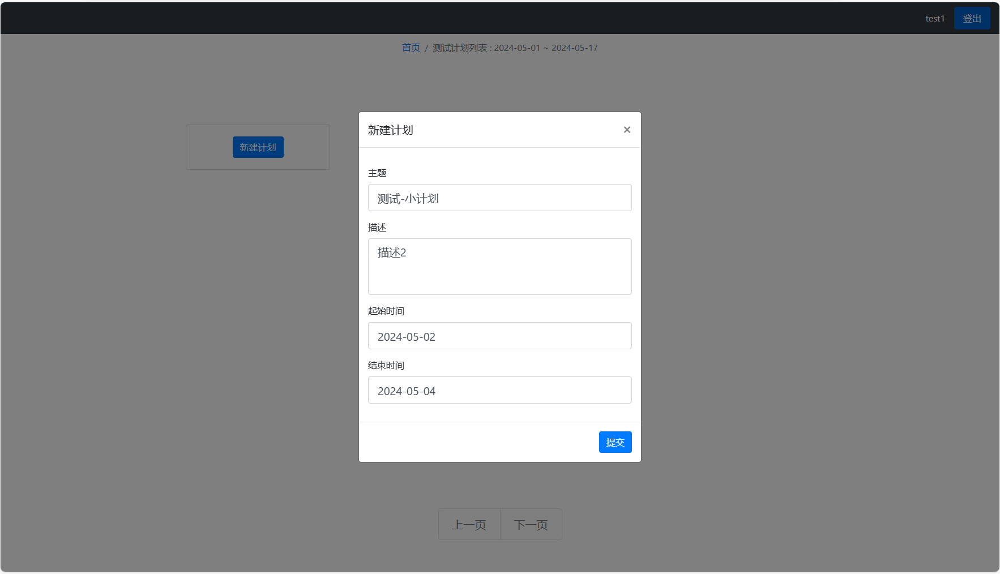
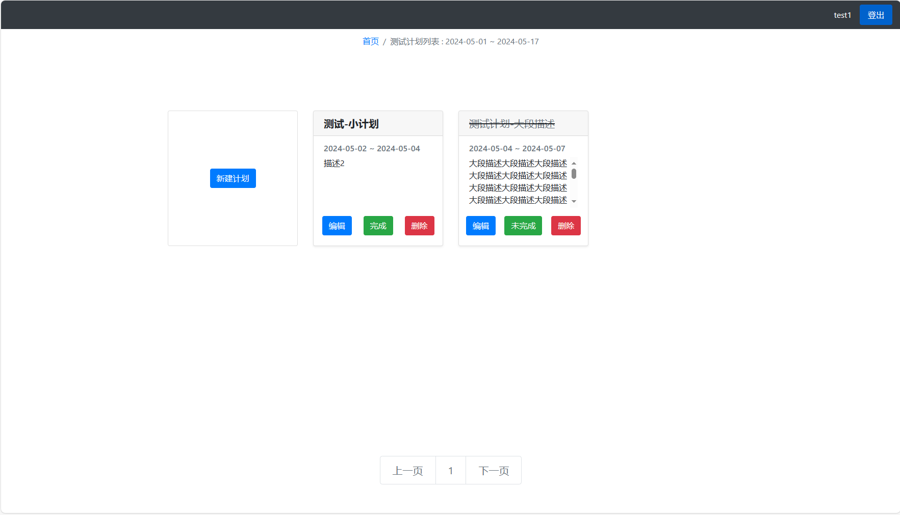
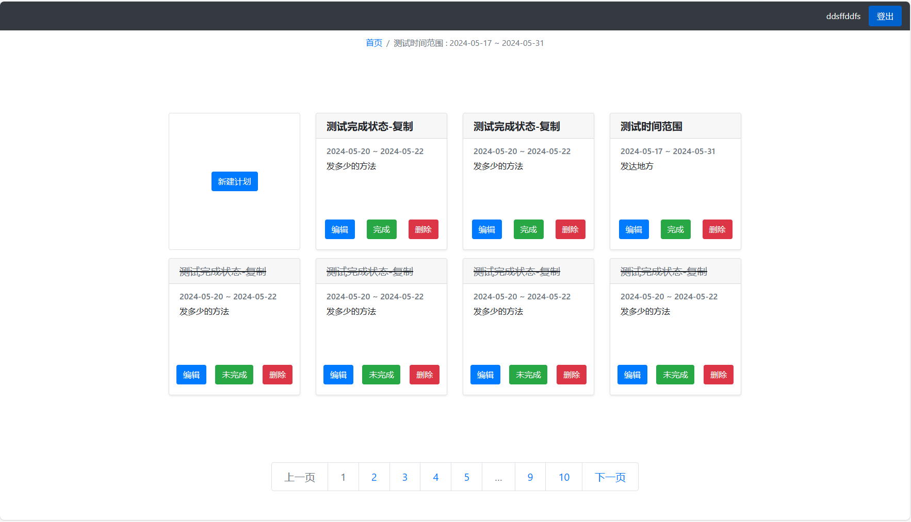

# todo
24年五一假期为了测试自己学习情况，尝试着搞了个待办清单类的Flask应用，包含简单的注册和登录功能，待办列表分为计划列表和计划两种，可以先创建计划列表然后再在计划列表中创建计划，每一个计划都可以在完成和未完成之间切换。

### 直接运行`python3 run.py`可直接开启flask服务器

### 运行`run.init_db()`可初始化数据库, 创建的Sqlite数据库文件会生成在instance文件夹中。
### 数据库的链接在`init_app\settings.py`中设置

---

### 登录

### 创建计划列表

### 创建计划

#### 添加后可以切换是否已完成

#### 支持分页，同时按已完成+结束时间更近优先对计划进行排序

### 后续计划

1. 为计划列表添加一个进度条，初步设想是已完成的子计划个数/总数
2. ……
## 用法

直接运行`python3 run.py`可直接开启flask服务器

运行`run.init_db()`可初始化数据库

数据库的链接在`init_app\settings.py`中设置
